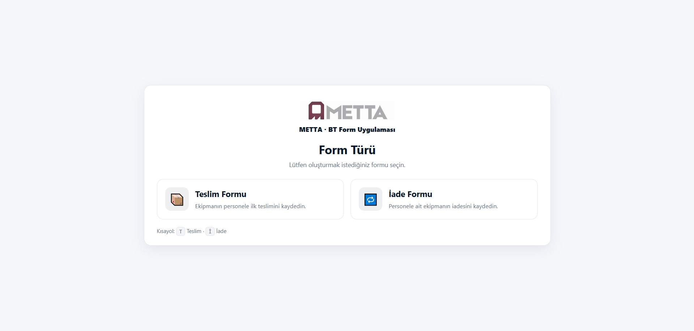
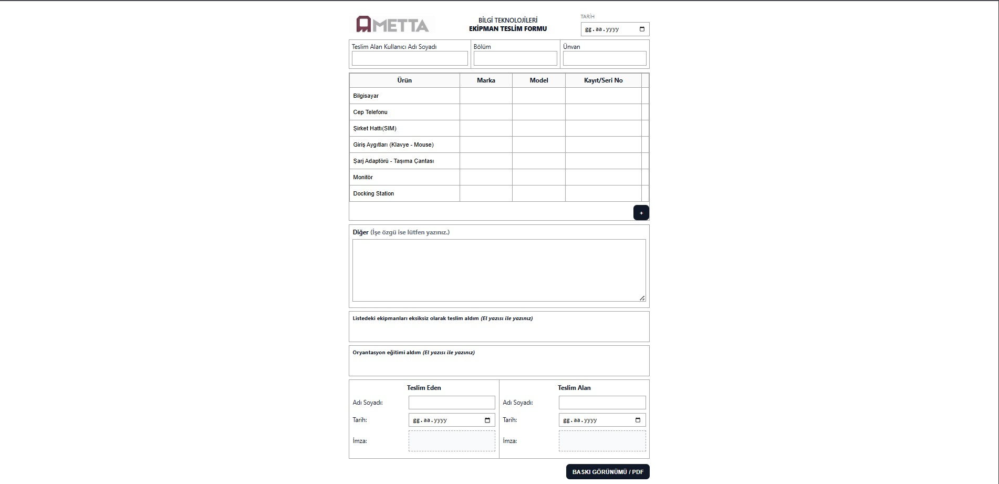
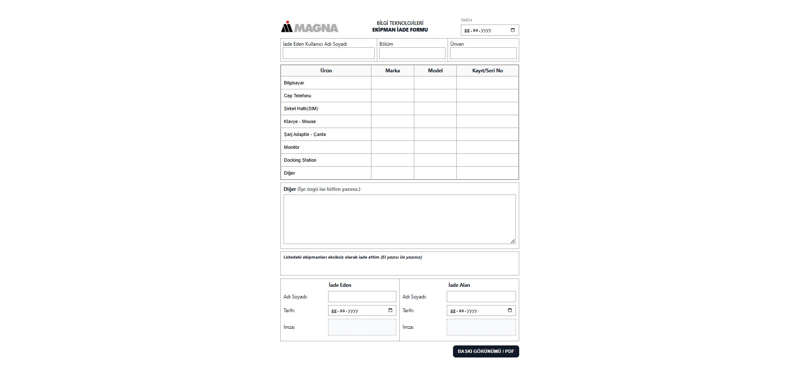
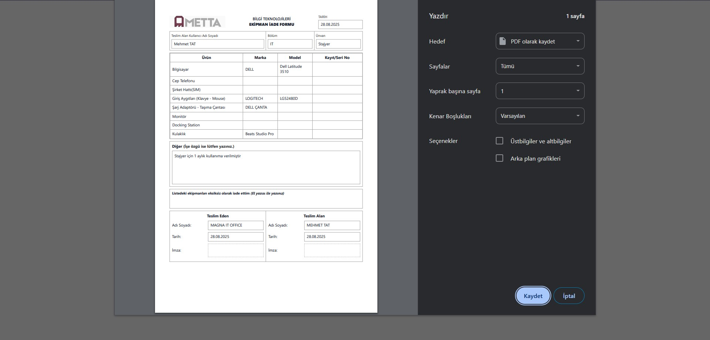

# 🏭 Corporate Equipment Delivery & Return Form

This project is a **Flask-based web application** developed to digitalize the processes of **equipment delivery** and **returns** in factory and office environments.  
Users can select the form type (Delivery or Return) from the home page, fill out the relevant form, and generate a **PDF output**.

## 🚀 Features
- 📌 **Form Selection:** Choose Delivery or Return on the home screen  
- 🖥️ **Equipment List:** Computer, phone, SIM card, monitor, etc.  
- ✏️ **Other Field:** Supports line wrapping for long text inputs  
- ➕ **Add Row Button:** Dynamically add new rows to the equipment table 
- 📄 **PDF Output:** Printable in corporate format with signature fields and logo  
- 🏭 **Corporate Design:** Logo area, centered login screen, and simple UI optimized for factory usage  

## 🛠 Technologies Used
- **Backend:** Python (Flask)  
- **Frontend:** HTML5, CSS3, Jinja2  
- **PDF:** Browser print (Print to PDF)  

## 📂 Project Structure
```
EKIPMAN-FORM/
├── screenshots/
│   ├── anasayfa.jpg
│   ├── iadeformu.jpg
│   ├── pdfsayfasi.jpg
│   └── teslimformu.jpg
├── static/
│   ├── magna-icon.png
│   ├── magna-logo.png
│   └── style.css
├── templates/
│   ├── form.html
│   ├── home.html
│   └── pdf.html
├── app.py
├── requirements.txt
└── venv/
```

## ⚙️ Installation & Run
```bash
# 1. Clone the repository
git clone https://github.com/mexmettat/ekipman-form.git
cd ekipman-form

# 2. Create and activate a virtual environment
python -m venv venv
source venv/bin/activate   # Mac/Linux
venv\Scripts\activate      # Windows

# 3. Install dependencies
pip install -r requirements.txt

# 4. Run the application
python app.py
```

👉 Open in browser: **http://127.0.0.1:5002**

## 📸 Screenshots
- **Home Page**  
  

- **Delivery Form**  
  

- **Return Form**  
  

- **PDF Output**  
  

## 👨‍💻 Developed By
**Mehmet TAT**  
- [GitHub](https://github.com/mexmettat)  
- [LinkedIn](https://www.linkedin.com/in/mehmettat/)

## ⚠️ NOTE
- The company name and logo have been changed due to legal restrictions on publishing them without permission, but this application is actively used by the IT team.
